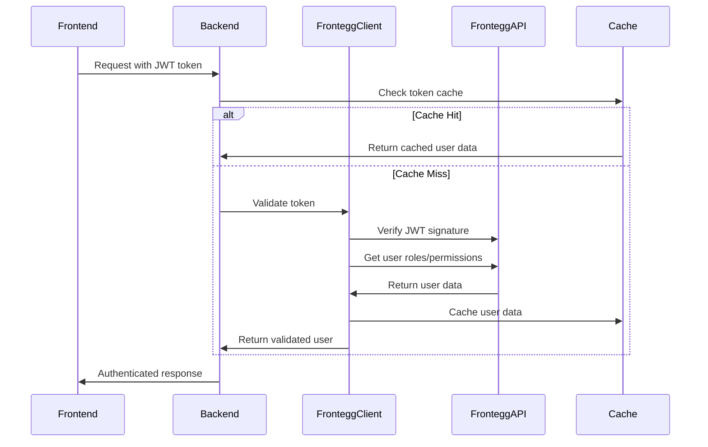

# Frontegg Backend Authentication Implementation Guide

## 🎯 **Overview**

This implementation follows the official Frontegg backend authentication patterns as documented at:
- https://docs.frontegg.com/docs/backend-authentication
- https://docs.frontegg.com/docs/nodejs-sdk

## 🏗️ **Architecture**

### **Components**

1. **FronteggClient** (`frontegg_client.py`): Core client following Frontegg SDK patterns
2. **Dependencies** (`dependencies.py`): FastAPI dependencies for authentication
3. **Token Cache** (`token_cache.py`): Performance optimization with Redis/local caching

### **Authentication Flow**



## 🔧 **Implementation Details**

### **1. Token Validation (Following Frontegg SDK Pattern)**

```python
# Equivalent to Frontegg Node.js SDK's validateIdentityOnToken
user_info = await frontegg_client.validate_identity_on_token(
    token,
    required_roles=["admin"],
    required_permissions=["read:files"]
)
```

### **2. API Access Token (Machine-to-Machine)**

```python
# Following POST /resources/auth/v2/api-token pattern
api_token = await frontegg_client._get_api_access_token()
```

### **3. User Role/Permission Retrieval**

```python
# Following /identity/resources/vendor-only/users/access-tokens/v1/{id}
user_with_roles = await frontegg_client._get_user_with_roles(user_id, tenant_id)
```

### **4. Active Token Verification**

```python
# Following /identity/resources/vendor-only/users/access-tokens/v1/active
is_active = await frontegg_client.verify_active_token(token)
```

## 🎯 **Usage Examples**

### **Basic Authentication**

```python
from fastapi import APIRouter, Depends
from ..auth import get_current_user

router = APIRouter()

@router.get("/protected")
async def protected_endpoint(user: dict = Depends(get_current_user)):
    return {"message": f"Hello {user['email']}!"}
```

### **Role-Based Access Control**

```python
from ..auth import require_roles

@router.get("/admin")
async def admin_endpoint(user: dict = Depends(require_roles(["admin"]))):
    return {"message": "Admin access granted"}
```

### **Permission-Based Access Control**

```python
from ..auth import require_permissions

@router.get("/files")
async def files_endpoint(user: dict = Depends(require_permissions(["read:files"]))):
    return {"files": []}
```

### **Organization Context**

```python
from ..auth import get_organization_context

@router.get("/org-data")
async def org_endpoint(org_context: dict = Depends(get_organization_context)):
    user = org_context["user"]
    org_id = org_context["organization_id"]
    return {"organization": org_id, "user": user["email"]}
```

### **Combined Requirements**

```python
from ..auth import require_roles_and_permissions

@router.delete("/admin/files/{file_id}")
async def delete_file_admin(
    file_id: str,
    user: dict = Depends(require_roles_and_permissions(
        required_roles=["admin"],
        required_permissions=["delete:files"]
    ))
):
    return {"message": f"File {file_id} deleted by admin {user['email']}"}
```

## 🔒 **Security Features**

### **1. JWT Signature Verification**
- Uses Frontegg's public key from JWKS endpoint
- Validates audience, issuer, and expiration
- Supports RS256 algorithm

### **2. Role & Permission Enforcement**
- Fetches real-time roles from Frontegg API
- Caches role data for performance
- Supports both roles and permissions

### **3. Organization Context**
- Validates user access to requested organization
- Supports X-Organization-ID header
- Falls back to user's default tenant

### **4. Token Caching**
- Redis-based caching for performance
- Local cache fallback
- Respects token expiration times
- Automatic cache invalidation

## 📊 **Performance Optimizations**

### **1. Multi-Level Caching**
```python
# 1. Check Redis cache
cached_user = await token_cache.get_cached_user(token)

# 2. Fallback to local cache
if not cached_user:
    cached_user = local_cache.get(token_hash)

# 3. Validate with Frontegg if not cached
if not cached_user:
    user = await frontegg_client.validate_identity_on_token(token)
```

### **2. API Token Caching**
```python
# Cache machine-to-machine tokens
self._api_token_cache[cache_key] = {
    'token': access_token,
    'expires_at': time.time() + expires_in - 60  # 1 minute buffer
}
```

### **3. Public Key Caching**
```python
@lru_cache(maxsize=1)
async def get_public_key(self) -> str:
    # Cached for the lifetime of the application
```

## 🚀 **Environment Configuration**

```bash
# Required environment variables
FRONTEGG_CLIENT_ID=your-client-id
FRONTEGG_CLIENT_SECRET=your-client-secret
FRONTEGG_BASE_URL=https://your-subdomain.frontegg.com
FRONTEGG_API_BASE_URL=https://api.frontegg.com

# Optional
REDIS_URL=redis://localhost:6380
```

## 🧪 **Testing**

### **Unit Tests**
```python
import pytest
from unittest.mock import AsyncMock
from ..auth.frontegg_client import FronteggClient

@pytest.mark.asyncio
async def test_validate_token_with_roles():
    client = FronteggClient()
    client._get_user_with_roles = AsyncMock(return_value={
        "roles": [{"name": "admin"}],
        "permissions": [{"name": "read:files"}]
    })
    
    user = await client.validate_identity_on_token(
        "mock-token",
        required_roles=["admin"]
    )
    
    assert user["roles"][0]["name"] == "admin"
```

### **Integration Tests**
```python
@pytest.mark.asyncio
async def test_protected_endpoint():
    async with AsyncClient(app=app, base_url="http://test") as client:
        response = await client.get(
            "/protected",
            headers={"Authorization": "Bearer valid-token"}
        )
        assert response.status_code == 200
```

## 🔄 **Migration from Old System**

### **Before (Custom JWT Verification)**
```python
# Old approach - basic JWT verification only
@router.get("/files")
async def get_files(user: dict = Depends(get_current_user)):
    # No role/permission checking
    # No organization context
    # Limited caching
```

### **After (Frontegg SDK Pattern)**
```python
# New approach - full Frontegg integration
@router.get("/files")
async def get_files(
    org_context: dict = Depends(get_organization_context)
):
    user = org_context["user"]
    org_id = org_context["organization_id"]
    # Full role/permission data available
    # Organization context validated
    # Optimized caching
```

## 📋 **Checklist for Implementation**

- [x] ✅ JWT signature verification with Frontegg public key
- [x] ✅ Role and permission validation
- [x] ✅ Organization/tenant context handling
- [x] ✅ API token for machine-to-machine auth
- [x] ✅ Active token verification endpoint
- [x] ✅ Multi-level caching (Redis + local)
- [x] ✅ FastAPI dependencies for easy usage
- [x] ✅ Error handling and logging
- [x] ✅ Environment configuration
- [ ] 🔄 Unit and integration tests
- [ ] 🔄 Documentation and examples
- [ ] 🔄 Performance monitoring

## 🎯 **Next Steps**

1. **Update all API endpoints** to use new authentication dependencies
2. **Add comprehensive tests** for all authentication scenarios
3. **Implement role-based access control** throughout the application
4. **Add monitoring and alerting** for authentication failures
5. **Document API changes** for frontend team

---

This implementation now follows Frontegg's official backend authentication patterns and provides the same functionality as their Node.js SDK.
